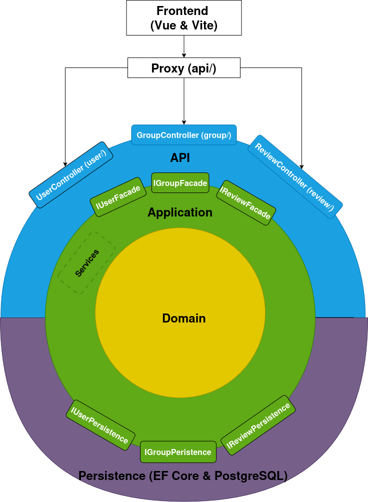

# Individueel project
In dit project wordt er een fullstack applicatie gebouwd voor het individuele project van Sogyo. Hierin word ik als trainee uitgedaagd om in 3 weken tijd een complete fullstack applicatie vanaf de grond op te bouwen.


## Domain coverage


## Doel
Het doel van TasteBuds is om mensen op een laagdrempelige en authentieke manier met elkaar in contact te brengen op basis van gedeelde interesses.

Hoewel er op traditionele sociale media enorm veel gedeeld wordt, ligt de focus daar vaak op uiterlijke schijn. Dit maakt het lastig om iemands werkelijke persoonlijkheid en diepere interesses te ontdekken. Daarnaast is het vaak een flinke zoektocht om te achterhalen wat vrienden of connecties in hun vrije tijd écht bezighoudt, zoals de boeken die ze lezen of de video's die ze inspireren.

TasteBuds lost dit op door een gezamenlijk platform te bieden waar gebruikers hun ervaringen met content – zoals boeken, films, video's en blogs – kunnen delen. Het platform fungeert als een plek om enerzijds je eigen favoriete media vast te leggen en anderzijds geïnspireerd te raken door de oprechte interesses van je vrienden.


## Build Instructie
Zorg ervoor dat de volgende software op je systeem is geïnstalleerd:
* **Node.js**: Versie `20.19+` of `22.12+` (LTS aanbevolen)
* **.NET SDK**: Versie `9.0+`
---
Open je terminal in de hoofdmap van het project en voer de volgende stappen uit.
  r naar de frontend-map, herstel de pakketten en start de development server:

```bash
cd frontend/
npm clean
npm run dev
```
*De frontend is nu bereikbaar via de URL die in de terminal verschijnt (meestal `http://localhost:5173`).*

### 2. Backend (API)
Open een nieuwe terminal/tabblad in de hoofdmap en start de .NET Web API op:

```bash
cd backend/
dotnet clean
dotnet restore
dotnet build
dotnet run --project Api --launch-profile https
```
*De API draait nu beveiligd op: **`https://localhost:7082`***

---


## Architecture
### 🧬 Laag 1 — Domain (De Kern)

| | |
|---|---|
| **Verantwoordelijkheid** | Bevat de pure business-entiteiten en domeinregels |
| **Afhankelijkheden** | **Geen** — volledig geïsoleerd |
| **Bestanden** | [User.cs](file:///home/nvdieren/Documents/Sogyo/repositories/individual-project/backend/Domain/Classes/User.cs), [Group.cs](file:///home/nvdieren/Documents/Sogyo/repositories/individual-project/backend/Domain/Classes/Group.cs), [Review.cs](file:///home/nvdieren/Documents/Sogyo/repositories/individual-project/backend/Domain/Classes/Review.cs), [ItemType.cs](file:///home/nvdieren/Documents/Sogyo/repositories/individual-project/backend/Domain/ItemType.cs) |
| **Kernprincipes** | Rijke entiteiten met private setters, encapsulatie van collecties (`IReadOnlyCollection`), business-validatie in constructors |

De Domain-laag kent drie entiteiten: **User** (met username-wijzigingslogica), **Group** (met member-management) en **Review** (met groepskoppelingen). Alle entiteiten genereren hun eigen `Guid` en beschermen hun state via `private set`.

---

### 📋 Laag 2 — Application (De Use Cases)

| | |
|---|---|
| **Verantwoordelijkheid** | Orchestreert use cases, definieert interfaces (poorten), en bevat applicatie-services |
| **Afhankelijkheden** | Alleen **Domain** |
| **Bestanden** | [UserFacade.cs](file:///home/nvdieren/Documents/Sogyo/repositories/individual-project/backend/Application/UserFacade.cs), [GroupFacade.cs](file:///home/nvdieren/Documents/Sogyo/repositories/individual-project/backend/Application/GroupFacade.cs), [ReviewFacade.cs](file:///home/nvdieren/Documents/Sogyo/repositories/individual-project/backend/Application/ReviewFacade.cs), [Interfaces/](file:///home/nvdieren/Documents/Sogyo/repositories/individual-project/backend/Application/Interfaces), [DTOs/](file:///home/nvdieren/Documents/Sogyo/repositories/individual-project/backend/Application/DTOs), [Services/](file:///home/nvdieren/Documents/Sogyo/repositories/individual-project/backend/Application/Services) |
| **Kernprincipes** | Facade Pattern voor use case orchestratie, interfaces als "poorten" voor DIP, DTOs als data-contract naar de buitenwereld |

De Application-laag is het hart van de applicatielogica. De **Facades** (`UserFacade`, `GroupFacade`, `ReviewFacade`) zijn de orchestrators die:
1. Input valideren
2. Domain-objecten aanmaken
3. Repositories aanroepen via **interfaces** (niet via concrete implementaties)
4. DTOs teruggeven aan de Api-laag

De **interfaces** (`IUserRepository`, `IGroupRepository`, `IReviewRepository`) fungeren als poorten: ze definiëren *wat* er nodig is, zonder te specificeren *hoe* het gedaan wordt.

---

### 💾 Laag 3 — Persistence (Infrastructuur)

| | |
|---|---|
| **Verantwoordelijkheid** | Database-interactie, data-mapping, implementatie van repository-interfaces |
| **Afhankelijkheden** | **Application** (voor interfaces) en **Domain** (voor entiteiten) |
| **Bestanden** | [UserRepository.cs](file:///home/nvdieren/Documents/Sogyo/repositories/individual-project/backend/Persistence/UserRepository.cs), [GroupRepository.cs](file:///home/nvdieren/Documents/Sogyo/repositories/individual-project/backend/Persistence/GroupRepository.cs), [AppDbContext.cs](file:///home/nvdieren/Documents/Sogyo/repositories/individual-project/backend/Persistence/AppDbContext.cs), [DependencyInjection.cs](file:///home/nvdieren/Documents/Sogyo/repositories/individual-project/backend/Persistence/DependencyInjection.cs) |
| **Kernprincipes** | Repository Pattern, EF Core Fluent API voor mapping, `internal` access modifiers voor encapsulatie |

De Persistence-laag **implementeert** de interfaces die de Application-laag definieert. Dankzij het Dependency Inversion Principle zou je PostgreSQL+EF Core kunnen vervangen door bijv. MongoDB of een in-memory store, zonder dat de Application- of Domain-laag gewijzigd hoeft te worden.

---

### 🌐 Laag 4 — Api (Presentatie)

| | |
|---|---|
| **Verantwoordelijkheid** | HTTP-requests afhandelen, routing, middleware, DI-bootstrapping |
| **Afhankelijkheden** | **Application** (functioneel) en **Persistence** (alleen voor DI-configuratie) |
| **Bestanden** | [Program.cs](file:///home/nvdieren/Documents/Sogyo/repositories/individual-project/backend/Api/Program.cs), [UserController.cs](file:///home/nvdieren/Documents/Sogyo/repositories/individual-project/backend/Api/Controllers/UserController.cs), [GroupController.cs](file:///home/nvdieren/Documents/Sogyo/repositories/individual-project/backend/Api/Controllers/GroupController.cs), [UserLoaderMiddleware.cs](file:///home/nvdieren/Documents/Sogyo/repositories/individual-project/backend/Api/Middleware/UserLoaderMiddleware.cs) |
| **Kernprincipes** | Dunne controllers die alleen delegeren, middleware voor cross-cutting concerns, DI-bootstrapping als compositie-root |

De Api-laag is het **entry point** van de applicatie. Controllers ontvangen HTTP-requests, mappen deze naar DTOs, en delegeren de logica aan de Application-laag via interfaces. De `UserLoaderMiddleware` laadt de ingelogde gebruiker voordat het request de controller bereikt.

---

### 🖥️ Frontend — Vue.js 3 (Presentatie)

| | |
|---|---|
| **Verantwoordelijkheid** | User interface, client-side routing, API-communicatie |
| **Technologie** | Vue.js 3 + TypeScript + Vite + TailwindCSS |
| **Bestanden** | [Pages](file:///home/nvdieren/Documents/Sogyo/repositories/individual-project/frontend/src/pages), [Components](file:///home/nvdieren/Documents/Sogyo/repositories/individual-project/frontend/src/components), [Services/api.ts](file:///home/nvdieren/Documents/Sogyo/repositories/individual-project/frontend/src/services/api.ts), [Router](file:///home/nvdieren/Documents/Sogyo/repositories/individual-project/frontend/src/router/index.ts) |
| **Kernprincipes** | Component-based architecture, type-safe DTOs, gecentraliseerde API-service, route guards voor authenticatie |

De frontend communiceert met de backend via de `apiPost`/`apiGet` functies in [api.ts](file:///home/nvdieren/Documents/Sogyo/repositories/individual-project/frontend/src/services/api.ts), die de `fetch` API gebruiken met `credentials: "include"` voor cookie-based authenticatie.


## Leerdoelen
### 🚀 Technisch

Binnen dit project ligt de focus op het bouwen van een robuuste fullstack applicatie. Ik wil mij verdiepen in de volgende technologieën:
- Frontend: Vue.js voor het bouwen van de frontend. Hierbij focus ik mij op het maken van een Progressive Web App die op alle verschillende platformen te gebruiken is.
- Backend: C# (.NET) voor een krachtige en schaalbare serveromgeving.
- Database & ORM: PostgreSQL als relationele database, waarbij ik gebruikmaak van Entity Framework (EF) Core om de integratie tussen de backend en de database soepel en objectgeoriënteerd te laten verlopen.

### 👤 Persoonlijk
- Requirements Engineering: Ik wil actief oefenen met het achterhalen en helder krijgen van de functionele en niet-functionele eisen van de applicatie.
- Stakeholder management: Ik focus mij op het effectief uitvragen van mijn Product Owner. Het doel is om vage wensen om te zetten in concreet gedefinieerde, gedocumenteerde en meetbare requirements op papier.